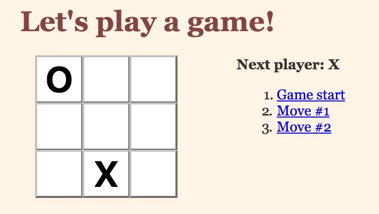

Let's practice from an existing codebase.

This repository contains the code for existing tic tac toe game programming in JavaScript using React. You can see it running [here](https://susiremondi.github.io/tictacReact/).

You'll be adding a feature to this game.

This tic-tac-toe game currently:

* lets you play tic-tac-toe
* indicates when one player has won the game
* stores the history of moves during the game

### Setting up

* Fork and clone this repository.

* You can run this with `npm start` from inside the `tictactoe` directory.

### Task

Your job is to allow players to jump back in time to see older versions of the game board.

Each move in the move list should be a link to jump back to that move. If you click any move link, the board should immediately update to show what the game looked like at that time.

Also, update `handleClick` to be aware of `stepNumber` when reading the current board state so that you can go back in time, then click in the board to create a new entry.

> Hint: It's easiest to `.slice()` off the extra elements from history at the very top of `handleClick`.

**You can see the desired solution [here](https://susiremondi.github.io/tictacSolution/)**

Note that the steps past the one you jump to do not need to disappear off the list. That is to say, from a board that looks like this:

Clicking on `Move #1` causes the board to jump back in time to move #1, but the move list has not changed.

However, from there the game can be played and new moves can then be overwritten in the history.

Try it yourself in the solution link above.

### Hints
- Keep track of the steps (so if we want to jump to move 3, we know what move 3 was!).
  - What do you declare in the constructor as a way to keep track of things?
- This will need to be updated whenever the user clicks a move
- You'll need a function that jumps to the right step and keeps track of who's next!
- Make sure you update `render` to make sure it pulls the right `history`
- Make sure `history` is updated correctly in the `handleClick` method
  -  a useful function is `.slice`, which makes a subset of an array. For example,
  `const history = this.state.history.slice(0, --where you are trying to go!--);`
- Don't forget to make the moves links!

## Solution

Solution code is provided in the `solution_src` folder of this repository. Please give this your best go before looking! A Changelist is also provided in that folder with a brief explanation.

This project was based off [this Facebook tutorial](https://facebook.github.io/react/tutorial/tutorial.html
). Click inside the link to see a thorough step by step tutorial of building out this tic tac toe app - note that in the tutorial, they don't split the components into different files.

*NOTE* The walk through for this question is also in this tutorial (near the end), so don't look until you've given it a thorough try!
